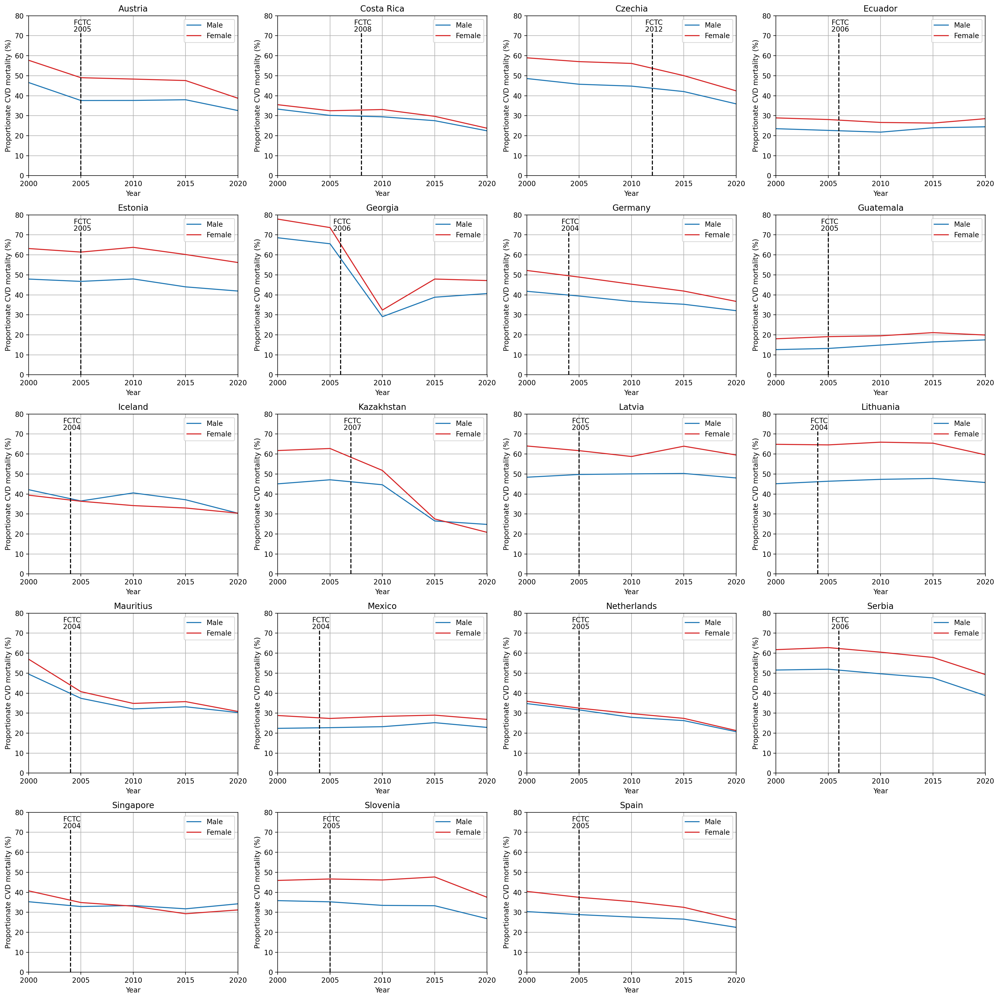
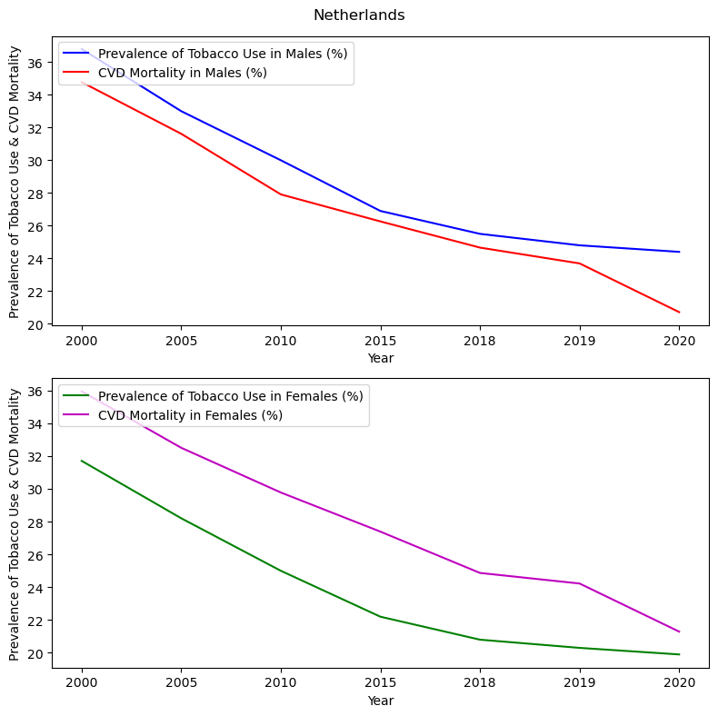

Assessing the impact of the WHO Framework Convention on Tobacco Control on Prevalence of Tobacco Use and Cardiovascular Disease Mortality.
===

# Data Source

Download raw data from open access database:

* [WHO Mortality Database](https://platform.who.int/mortality/themes/theme-details/topics/topic-details/MDB/cardiovascular-diseases)
* [WHO The Global Health Observatory](https://www.who.int/data/gho/data/themes/topics/sdg-target-3_a-tobacco-control)
* [Signature and Ratification of FCTC from UN](https://treaties.un.org/pages/ViewDetails.aspx?src=TREATY&mtdsg_no=IX-4&chapter=9&clang=_en)

# Installation

Download and install [Git](https://git-scm.com/downloads)
Download and install [Python](https://www.python.org/downloads/)

```
conda create -n [ENV_NAME] python=3.10 
conda activate [ENV_NAME]  
cd [CLONED_DIRECTORY]
pip install -r requirements.txt
```

- Buildup the src path

```
conda install conda-build
conda develop src
cd src
```

# Usage

## Cleaning process

- Cleans the mortality dataframe by removing specified columns and filtering rows with missing values

`from utility import select_df`

## Preprocess the WHO CVD mortality data

- Prepares and filters cardiovascular disease data
- Groups data into specific age categories

`from utility import preprocess_cvd, create_age_grouping`

## Preprocess the Prevalence of Tobacco Use data

- Formats the tobacco data for merging

`from utility import tobacco_layout_modified`

## Merge CVD df and tobacco df

- Merges CVD and tobacco data by country

`from utility import tobacco_layout_modified`

## Determine countries who signed the WHO FCTC treaty

`WHOFCTC_parties_date.py`

# Data visualization

## Preprocess

`preprocess_analysis.py`

## create figures

`plot.py`

#### Example 1 of multi-subplot line chart

```
df = pd.read_excel('~/test_file/19_ratified_country.xlsx')
plot_line_chart(df,column1='Male_Total_Percentage_of_Cause_Specific_Deaths_Out_Of_Total_Deaths' ,
                    column2='Female_Total_Percentage_of_Cause_Specific_Deaths_Out_Of_Total_Deaths',
                    save_path=[CLONED_DIRECTORY])
```



#### Example 2 of line chart between CVD Mortality and Prevalence of Tobacco Use in both Males and Females in Netherland

```
df = pd.read_excel('~/test_file/19_ratified_country.xlsx')
select_country = ['Netherlands']
male_tobacco = 'Male_Estimate_of_Current_Tobacco_Use_Prevalence_age_standardized_rate'
male_cvd = 'Male_Total_Percentage_of_Cause_Specific_Deaths_Out_Of_Total_Deaths'
female_tobacco = 'Female_Estimate_of_Current_Tobacco_Use_Prevalence_age_standardized_rate'
female_cvd = 'Female_Total_Percentage_of_Cause_Specific_Deaths_Out_Of_Total_Deaths'
save_path = "[CLONED_DIRECTORY]/[FIGURE_NAME].png"

relationship_cvd_tobacco(df, select_country=select_country,
                         variable_1=male_tobacco,
                         variable_2=male_cvd,
                         variable_3=female_tobacco,
                         variable_4=female_cvd, save_path=[CLONED_DIRECTORY]
                         )

```



## Dashboard

Please download the dashboard.pbix file and open it in Power BI

# Contact

[Wei Jan, Chang](mailto:weijan.chang@gmail.com)
